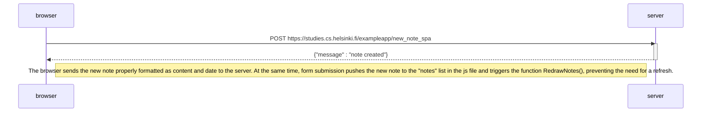

```mermaid
sequenceDiagram
    participant browser
    participant server


    browser->>server: POST https://studies.cs.helsinki.fi/exampleapp/new_note_spa
    activate server
    server-->>browser: {"message" : "note created"}
    deactivate server
    
    Note right of browser: The browser sends the new note properly formatted as content and date to the server. At the same time, form submission pushes the new note to the "notes" list in the js file and triggers the function RedrawNotes(), preventing the need for a refresh.

   
```